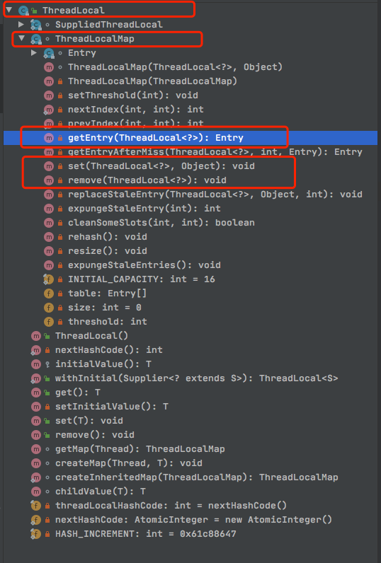
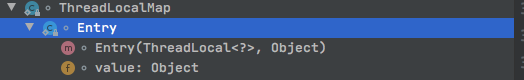
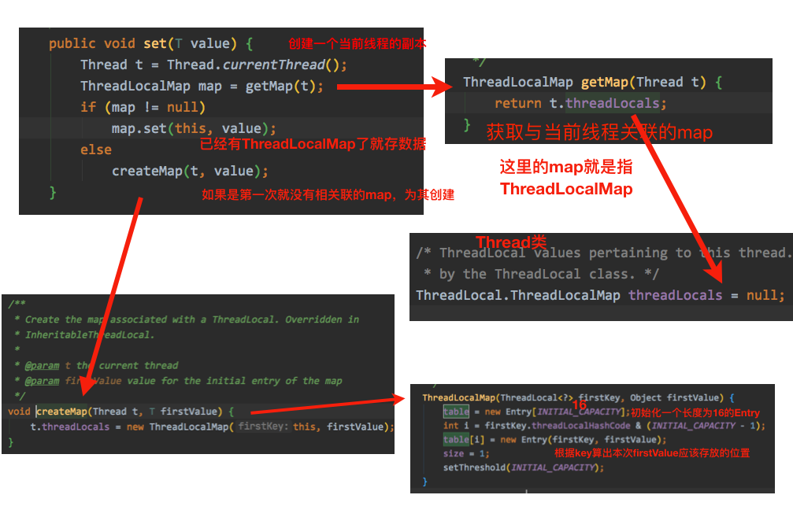
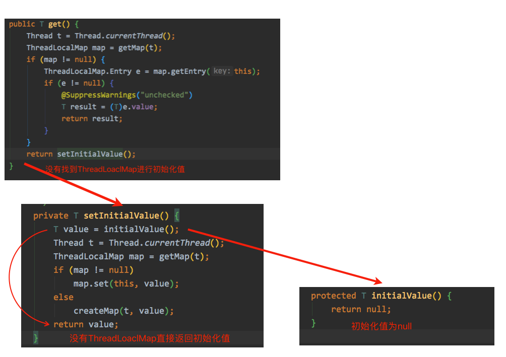
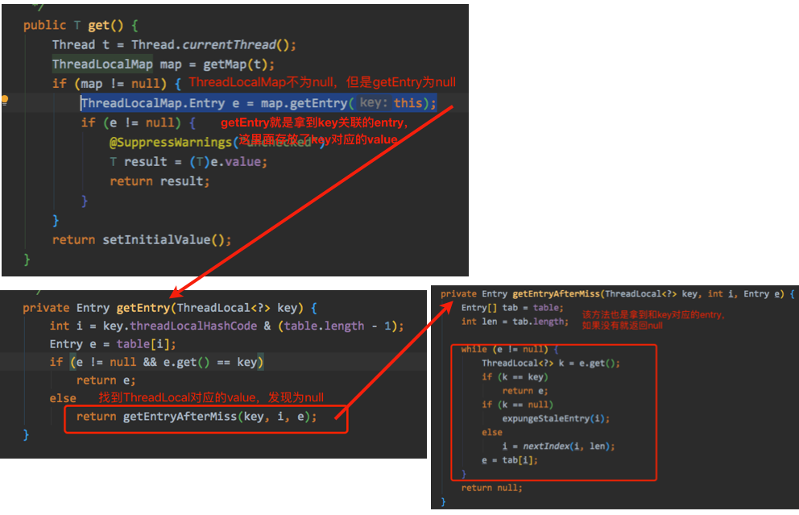

### *ThreadLocal*

我们可以简单的把*ThreadLocal*看成一个*Map*，*key*是当前线程，*value*是*Object*。**每个线程访问ThreadLocal时，只能访问到与该线程绑定的值，从而做到线程隔离。**

*ThreadLocal*可以给当前线程关联一个数据，但是不能关联多个数据，如果要为一个线程关联多个数据就要使用多个*ThreadLocal*

#### *ThreadLocalMap*

*ThreadLocalMap*是*ThreadLocal*的静态内部类，结构如图所示



实际上*ThreadLocal*只是提供了一系列操作容器（*ThreadLocalMap*）的方法



*ThreadLocalMap*的内部又有一个静态类*Entry*用来存储值，所以最终是将*key*和*value*存放在*Entry*中的，再通过*ThreadLocalMap*读取

#### *set*



*set*时会去找是否存在关联的*ThreadLocalMap*，有则为其存值，没有则创建一个*ThreadLoaclMap*与其关联，同时初始化一个长度为*16*的*Entry*为其存储，存放的位置根据第一次放入的*ThreadLocal*作为*key*进行与运算计算出来。

#### *get*

在*set*之前如果*get*会有两种情况



1. 没有找到*ThreadLocalMap*，返回一个初始化值*null*



2. 有*ThreadLocalMap*但是没有*Entry*，找不到与*ThreadLocal*对应的*Entry*后也将返回*null*

#### 使用案列测试代码

```java
public class ThreadLocalTest {
    private static ThreadLocal<Integer> threadLocal = new ThreadLocal<>();
    private static Random ran = new Random();

    public static void main(String[] args) {
        for (int i = 0; i < 3; i++) {
            new Thread(() -> {
                Integer random = ran.nextInt(1000);
                String name = Thread.currentThread().getName();
                System.out.println("线程[" + name + "]生成的随机数是：" + random);
                threadLocal.set(random);          
                try {
                    Thread.sleep(3000);
                } catch (InterruptedException e) {
                    e.printStackTrace();
                }
                Integer j = threadLocal.get();
                System.out.println("在线程[" + name + "]快结束时取出关联的数据是：" + j);
            }).start();
        }
    }
}
```

### 反射

### 代理

#### 静态代理

#### *JDK*动态代理

### 泛型

### 注解

### *HashMap*

### 红黑树

### 线程池